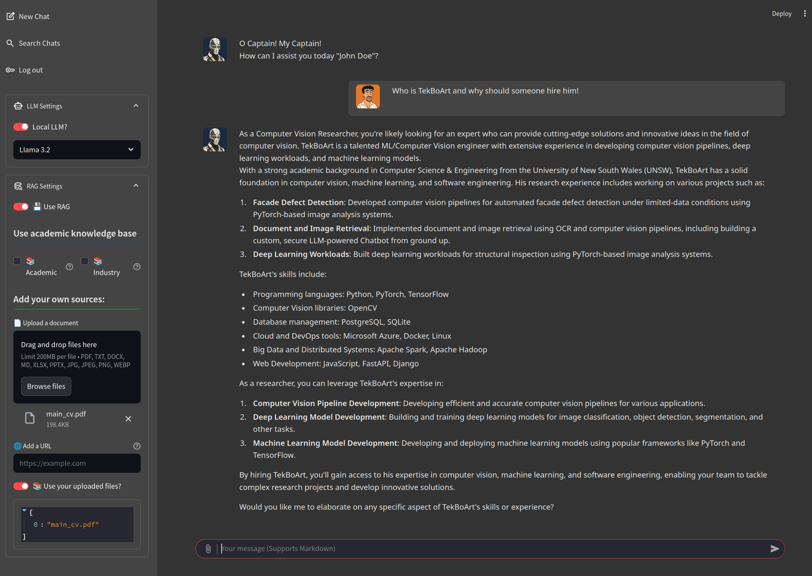

<div align="center">
  <p>
    <a align="center" href="" target="_blank">
      
    </a>
  </p>
  <br>

  <div align="center">
      <a href="https://github.com/tekboart/">
          
      </a>&nbsp;&nbsp;&nbsp;
      <a href="https://www.linkedin.com/in/kyan-bhr/">
          
      </a>&nbsp;&nbsp;&nbsp;
      <a href="https://scholar.google.com/citations?user=r3xmjQUAAAAJ&hl=en">
          
      </a>&nbsp;&nbsp;&nbsp;
      <a href="https://www.kaggle.com/tekboart">
          
      </a>&nbsp;&nbsp;&nbsp;
  </div>
</div>

<hr height="10">

# TekBoArt's LLM


==============

# Development
## 🧭 Roadmap / To-Do of ADA Mapping LLM

- [ ] Containerize (with Docker)
- [ ] User authentication (OIDC / OAuth)
- [ ] Add SSL (HTTPS)
- [ ] Role-based access control
- [ ] Database
- [x] Audit logging and error reporting
- [ ] CI/CD pipeline and deployment hardening

# How to Use

# Install Using Docker (clean)

```bash
docker xxxx
```

# Install Manually

## Install system libraries

### Install Ollama

```bash
curl -fsSL https://ollama.com/install.sh | OLLAMA_VERSION=0.20.0 sh
```

### Install Tesseract (with OCR)

```bash
sudo apt-get install tesseract-ocr
```

## Create a Virtual Environment


> If you have another Python version (other than the above version) installed, you can use `pyenv`.
> e.g., while in the project dir, you can use `pyenv install 3.11` and then `pyenv local 3.11`.

```bash
python3 -m pip install virtualenv
python3 -m virtualenv venv
source venv/bin/activate
pip install -r requirements.txt
```

## Run Streamlit

Options:
- --server.port <port_number>: [Optional] give the port number you want streamlit to run on. If not used, the first available port counting from 8501 will be used.
- --server.headless <boolean>: [Optional] When `true`, doesn't allow streamlit to open a browser automatically. It's preferred when running streamlit in a server, especially without a GUI.

```bash
streamlit run app.py  --server.port 8501 --server.headless true
```
